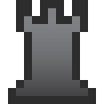

isepic-chess-ui
================

Isepic Chess UI is the user interface for [isepic-chess.js (GitHub repo)](https://github.com/ajax333221/isepic-chess). It uses jQuery for DOM manipulation and animations.

Table of contents
-------------

- [isepic-chess-ui](https://github.com/ajax333221/isepic-chess-ui#isepic-chess-ui)
- [Table of contents](https://github.com/ajax333221/isepic-chess-ui#table-of-contents)
- [How to use?](https://github.com/ajax333221/isepic-chess-ui#how-to-use)
- [Demo](https://github.com/ajax333221/isepic-chess-ui#demo)
- [Features](https://github.com/ajax333221/isepic-chess-ui#features)
- [Documentation](https://github.com/ajax333221/isepic-chess-ui#documentation)
	- [Board UI methods](https://github.com/ajax333221/isepic-chess-ui#list-of-boarduimethods)
- [To do](https://github.com/ajax333221/isepic-chess-ui#to-do)
- [Copyright and license](https://github.com/ajax333221/isepic-chess-ui#copyright-and-license)

How to use?
-------------

1. Add the necessary files (the order of the **.js** files is important):

```
<link rel="stylesheet" href="./css/isepic-chess-ui.css">
<script src="./js/jquery-3.3.1.min.js"></script>
<script src="./js/isepic-chess.js"></script>
<script src="./js/isepic-chess-ui.js"></script>
```

2. Wrap your code inside `$(function(){...});` to wait for the DOM to be ready.

```
<script>
$(function(){
	var board = Ic.initBoard({
		boardName : "main"
	});
});
</script>
```
<sub>**Note:** Documentation for `Ic.initBoard()` can be found [here](https://github.com/ajax333221/isepic-chess#documentation).</sub>

3. Add the elements you need (don't add them more than once) inside `<body>`.
```
<div id="ic_ui_board"></div>
<div id="ic_ui_materialdiff"></div>
<input id="ic_ui_fen" value="" type="text">
<input id="ic_ui_nav_first" value="|<" type="button">
<input id="ic_ui_nav_previous" value="<" type="button">
<input id="ic_ui_nav_next" value=">" type="button">
<input id="ic_ui_nav_last" value=">|" type="button">
<input id="ic_ui_rotate" value="rotate" type="button">
<select id="ic_ui_promote">
	<option value="5" selected="selected">queen</option>
	<option value="4">rook</option>
	<option value="3">bishop</option>
	<option value="2">knight</option>
</select>
<div id="ic_ui_tabs"></div>
<div id="ic_ui_movelist"></div>
```
<sub>**Note:** there are classes that enhance them (no documentation for this yet, see `index.html` and `isepic-chess-ui.css` for help).</sub>

4. Open the **.html** file.

Demo
-------------

https://ajax333221.github.io/isepic-chess-ui/

Features
-------------

- Highlight legal moves / last move
- Navigation buttons
- Jump to move from the move list
- Adaptable board size
- Pawn promotion dropdown menu
- Visual material difference
- Piece displacement animation
- Chess-font by ajax333221 

Documentation
-------------

You should first read the [isepic-chess.js Documentation](https://github.com/ajax333221/isepic-chess#documentation).

#### List of `board.<UImethods>(...)`:

> **Note:** the board UI methods will automatically start working when **isepic-chess-ui.js** is present, otherwise nothing will happen when they are called.

Boards created by `Ic.initBoard()` have the following available UI methods.

Function | Parameters | Return | Board refresh? | Description
-------- | ---------- | ------ | ---------------- | -----------
**refreshBoard**(<br>*animationType*<br>) | <ul><li>:eight_pointed_black_star:animationType (Number)</li></ul><hr>:eight_pointed_black_star:Optional Parameter | - | Yes | When refreshing a **non-hidden board** <sup>(nothing will take place if called on a **board** with `board.isHidden = true`)</sup>, this method will:<ul><li>Refresh the HTML of all the components (if any) to reflect the internal state of the board.</li><li>Re-bind everything to point to this board.</li><li>Finish any ongoing piece animations.</li><li>Start the current animation (if any).</li></ul>If `animationType` is a falsy-value, no animation will happen.<br><br>If `animationType` is a **positive number**, the board will be refreshed with an animation as if the last move was just played.<br><br>If `animationType` is a **negative number**, the board will be refreshed with an animation as if we just made a takeback move from the next move.

To do
-------------

- Drag-and-drop pieces
- Create, rename and delete boards through the UI
- Set-up position mode
- Variety of themes and chess-fonts

Copyright and license
-------------

Copyright © 2020 Ajax Isepic (ajax333221)

Licensed under MIT License: http://opensource.org/licenses/mit-license.php
