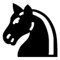
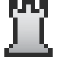
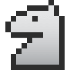
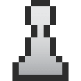
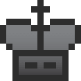
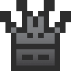
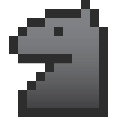
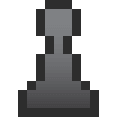

<p align="center"><a href="https://github.com/ajax333221/isepic-chess-ui"></a></p>

<h1 align="center">isepic-chess-ui</h1>

Isepic Chess UI is the user interface for [isepic-chess.js](https://github.com/ajax333221/isepic-chess). It uses jQuery for DOM manipulation and animations.

:pushpin: Table of contents
-------------

- [isepic-chess-ui](https://github.com/ajax333221/isepic-chess-ui#isepic-chess-ui)
- [Table of contents](https://github.com/ajax333221/isepic-chess-ui#pushpin-table-of-contents)
- [How to use?](https://github.com/ajax333221/isepic-chess-ui#computer_mouse-how-to-use)
- [Demo](https://github.com/ajax333221/isepic-chess-ui#eye-demo)
- [Features](https://github.com/ajax333221/isepic-chess-ui#rocket-features)
- [Documentation](https://github.com/ajax333221/isepic-chess-ui#book-documentation)
- [Copyright and license](https://github.com/ajax333221/isepic-chess-ui#page_facing_up-copyright-and-license)

:computer_mouse: How to use?
-------------

1. Add the necessary files (the order of the **.js** files is important):

```html
<link rel="stylesheet" href="./css/isepic-chess-ui.css">

<script src="./js/jquery-3.3.1.min.js"></script>
<script src="./js/isepic-chess.js"></script>
<script src="./js/isepic-chess-ui.js"></script>
```

2. Wrap your code inside `$(function(){...});` to wait for the DOM to be ready.

```html
<script>
  $(function(){
    //you can overwrite configuration options
    IcUi.setCfg("soundEffects", false);
    IcUi.setCfg("scrollNavigation", false);
    IcUi.setCfg("animationTime", 150);
    
    //initialize a board
    var board = Ic.initBoard({
      boardName: "main"
    });
  });
</script>
```
<sub>**Note:** documentation for `Ic.initBoard()` can be found [here](https://github.com/ajax333221/isepic-chess/blob/master/docs/ic-methods.md#ic-methods).</sub>

3. Add some [components](https://ajax333221.github.io/isepic-chess-ui/components.html) (don't add them more than once) inside `<body>`.

4. Open the **.html** file.

:eye: Demo
-------------

https://ajax333221.github.io/isepic-chess-ui/

:rocket: Features
-------------

- Responsive board size
- Both *drag-and-drop* and *click-from-click-to* in parallel
- Highlight last move, legal moves and checks
- [Components](https://ajax333221.github.io/isepic-chess-ui/components.html):
	- Chess [board](https://ajax333221.github.io/isepic-chess-ui/components.html#board)
	- [Board tabs](https://ajax333221.github.io/isepic-chess-ui/components.html#board_tabs) (with *switch-to-board* links)
	- [Material difference](https://ajax333221.github.io/isepic-chess-ui/components.html#material_diff) (small piece icons)
	- Navigation buttons ([first](https://ajax333221.github.io/isepic-chess-ui/components.html#first), [previous](https://ajax333221.github.io/isepic-chess-ui/components.html#previous), [next](https://ajax333221.github.io/isepic-chess-ui/components.html#next) and [last](https://ajax333221.github.io/isepic-chess-ui/components.html#last))
	- [Rotate](https://ajax333221.github.io/isepic-chess-ui/components.html#rotate) board button
	- [Promotion dropdown](https://ajax333221.github.io/isepic-chess-ui/components.html#promote)
	- SAN [move list](https://ajax333221.github.io/isepic-chess-ui/components.html#move_list) (with *jump-to-move* links)
	- Selectable [FEN](https://ajax333221.github.io/isepic-chess-ui/components.html#fen) text
	- [Debug toggler](https://ajax333221.github.io/isepic-chess-ui/components.html#debug_toggler)
	- [Debug](https://ajax333221.github.io/isepic-chess-ui/components.html#debug)
- Automatic component binding, no need to do anything manually to the DOM elements (they will simply work just by having their correct id property at any given time)
- Piece displacement animation
- Chess fonts:
	- **Merida** 
	- **isepic-chess-font** <sup>(by ajax333221)</sup> 
- Sound effects
- Move navigation via scrolling and arrow keys
- Puzzle mode (:construction: work in progress :construction:)

:book: Documentation
-------------

> **Note:** make sure to also read the [isepic-chess.js Documentation](https://github.com/ajax333221/isepic-chess#book-documentation).

- [Components](https://ajax333221.github.io/isepic-chess-ui/components.html)
- [Ic Ui methods](https://github.com/ajax333221/isepic-chess-ui/blob/master/docs/ic-ui-methods.md#ic-ui-methods)
- [Board Ui methods](https://github.com/ajax333221/isepic-chess-ui/blob/master/docs/board-ui-methods.md#board-ui-methods)

:page_facing_up: Copyright and license
-------------

Copyright © 2021 Ajax Isepic (ajax333221)

Licensed under MIT License: http://opensource.org/licenses/mit-license.php
