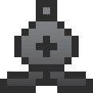

isepic-chess-ui
================

Isepic Chess UI is the user interface for [isepic-chess.js (GitHub repo)](https://github.com/ajax333221/isepic-chess). It uses jQuery for DOM manipulation and animations.

Demo
-------------

https://ajax333221.github.io/isepic-chess-ui/

Features
-------------

- Highlight legal moves / last move
- Navigation buttons
- Jump to move from the move list
- Pawn promotion dropdown menu
- Visual material difference
- Piece displacement animation
- ~~Drag-and-drop pieces~~ (currently disabled)
- Chess-font by ajax333221 

How to use?
-------------

1. Add the necessary files (the order of the **.js** files is important):

```
<link rel="stylesheet" href="./css/isepic-chess-ui.css">
<script src="./js/jquery-3.3.1.min.js"></script>
<script src="./js/isepic-chess.js"></script>
<script src="./js/isepic-chess-ui.js"></script>
```

2. Wrap your code inside `$(function(){...});` to wait for the DOM to be ready.

```
<script>
$(function(){
	var board = Ic.initBoard({
		boardName : "main"
	});
	
	board.refreshBoard();
});
</script>
```
<sub>**Note:** Documentation for `Ic.initBoard()` can be found [here](https://github.com/ajax333221/isepic-chess#documentation).</sub>

3. Open the **.html** file.

Documentation
-------------

You should first read the [isepic-chess.js Documentation](https://github.com/ajax333221/isepic-chess#documentation).

#### List of `board.<UImethods>(...)`:

> **Note:** the board UI methods will automatically start working when **isepic-chess-ui.js** is present, otherwise nothing will happen when they are called.

Boards created by `Ic.initBoard()` have the following available UI methods.

Function | Parameters | Return | Board refresh? | Description
-------- | ---------- | ------ | ---------------- | -----------
**navFirst()** | - | Boolean | Yes | Changes the `board.currentMove` to `0`.
**navPrevious()** | - | Boolean | Yes | Changes the `board.currentMove` to `(board.currentMove-1)`.
**navNext()** | - | Boolean | Yes | Changes the `board.currentMove` to `(board.currentMove+1)`.
**navLast()** | - | Boolean | Yes | Changes the `board.currentMove` to `(board.moveList.length-1)`.
**navLinkMove**(<br>*moveIndex*<br>) | <ul><li>moveIndex (Number)</li></ul> | Boolean | Yes | Changes the `board.currentMove` to a new move index.
**refreshBoard**(<br>*animationType*<br>) | <ul><li>:eight_pointed_black_star:animationType (Number)</li></ul><hr>:eight_pointed_black_star:Optional Parameter | - | Yes | The following will happen with a board refresh:<ul><li>Append to the `body` the base HTML (only if it didn't exist).</li><li>Update the **HTML board** with the board in its current state.</li><li>Finish any ongoing piece animations.</li><li>Start the current animation (if any).</li><li>Change all the bindings to this board.</li><li>Update the FEN and debug.</li></ul>If `animationType` a falsy-value, no animation will happen.<br><br>If `animationType` is a **positive number**, the board will be refreshed with an animation as if the last move was just played.<br><br>If `animationType` is a **negative number**, the board will be refreshed with an animation as if we just made a takeback move from the next move.

To Do
-------------

- Adaptable board size
- Create, rename and delete boards through the UI
- Set-up position mode
- Break down components for customizability
- Variety of themes and chess-fonts

Copyright and License
-------------

Copyright © 2020 Ajax Isepic (ajax333221)

Licensed under MIT License: http://opensource.org/licenses/mit-license.php
